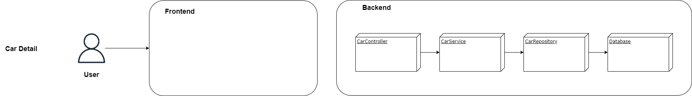
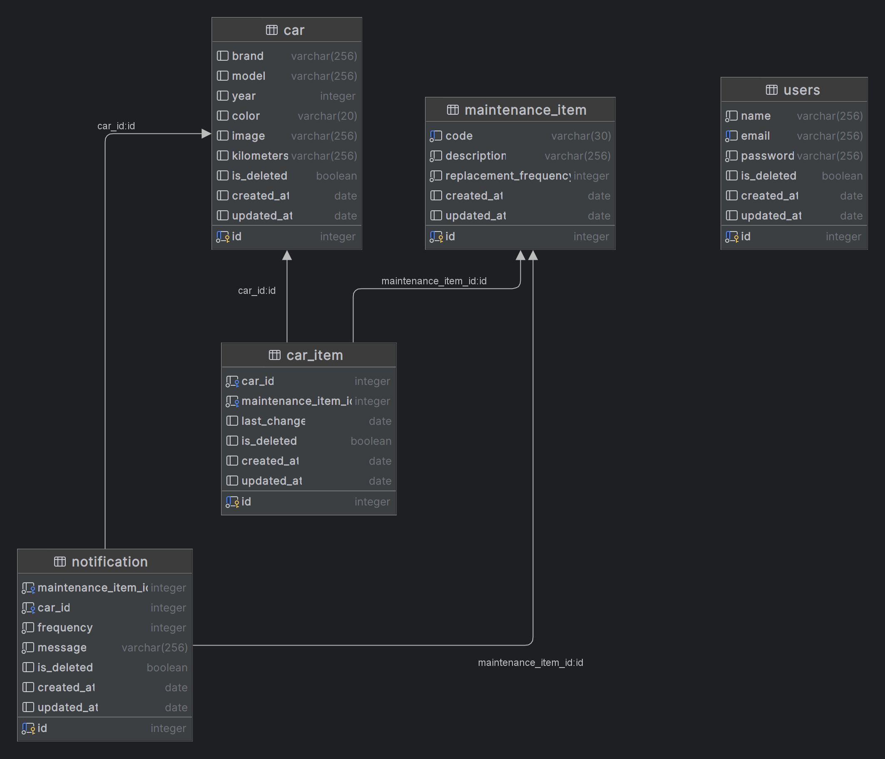
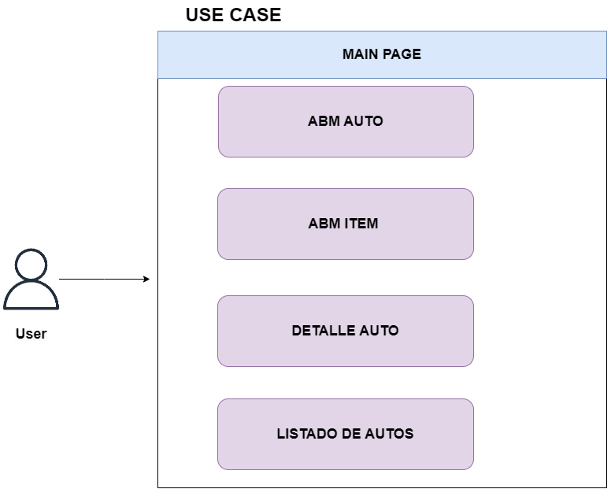

# Kuruma-Docs

**Descripción:**
Kuruma es un proyecto que tiene como objetivo convertirse en una web-app para centralizar la administración de un vehículo. Este proyecto se encuentra actualmente en una etapa de concepto (PoC).

**Presentación:**
Puedes encontrar una presentación detallada del proyecto en este [enlace](https://docs.google.com/presentation/d/1PSSQ1QTzhdLFFvP2EvH3GRkeTXDN7T419HXD_mnkW1M/edit?usp=sharing).

## Acerca de Kuruma
Kuruma busca simplificar la gestión y seguimiento de tu vehículo, proporcionando una plataforma web fácil de usar y centralizada para administrar la información relacionada con tu vehículo.

## Características Principales
- **Gestión de Datos**: Registra y administra información sobre tu vehículo, como mantenimientos, reparaciones, asi como tambien fechas de registro de conducir. Verificaciòn tècnica, etc.
- **Notificaciones**: Recibe recordatorios y alertas relacionadas con el mantenimiento y los plazos importantes de tu vehículo.

# Arquitectura:
<b>Usuario consultando el detalle de su auto</b>

# UML

 

# Casos de uso

<b> POC: </b> 

# Auto 
 

<b> Detalle de auto </b>
 
El usuario puede consultar los detalles del auto, información sobre el auto y el último mantenimiento. También recomendaciones y consejos
 

<b> Listado de autos </b>
 
El usuario explora la lista de autos y puede seleccionarlos para ver el detalle de cada uno.
 

<b> Agregar auto </b>
 
El usuario puede agregar un auto a su lista de autos, ingresando la información del auto y el último mantenimiento.
 

<b> Editar auto </b>
 
El usuario puede editar la información de un auto, como el nombre, modelo, año, etc.
 

<b> Eliminar auto </b>
 
El usuario puede eliminar un auto de su lista de autos.
 

<b> Ver estadísticas del auto </b>
 

El usuario puede ver las estadísticas de un auto, como el kilometraje, el estado de sus componentes, etc.

 

# Mantenimientos

<b> Agregar mantenimiento/item </b>
 
El usuario puede agregar un mantenimiento a un auto, ingresando la información del mantenimiento.
 

<b> Editar mantenimiento/item </b>
 
El usuario puede editar la información de un mantenimiento, como la fecha, kilometraje, etc.
 
    
<b> Eliminar mantenimiento/item </b>
 
El usuario puede eliminar un mantenimiento de un auto.

# Notificaciones

 

<b> Agregar notificación </b>
 

El usuario puede agregar una notificación a un auto, ingresando la información de la notificación.

 

<b> Editar notificación </b>
 

El usuario puede editar la información de una notificación, como el tipo de item, la frecuencia, etc.

 

<b> Eliminar notificación </b>

 

El usuario puede eliminar una notificación de un auto.

 

<b> Ver notificaciones </b>

 

El usuario puede ver las notificaciones de un auto.

 

# Usuario

 

<b> Iniciar sesión </b>

 

El usuario puede iniciar sesión en la aplicación.

 

<b> Registrarse </b>

 

El usuario puede registrarse en la aplicación.

 

