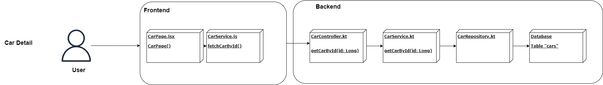
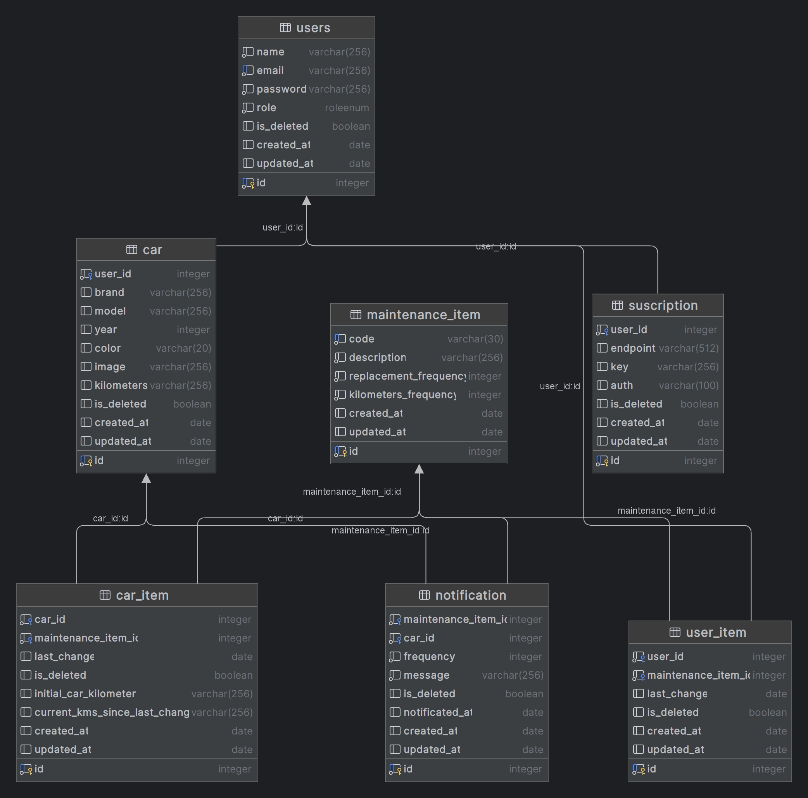
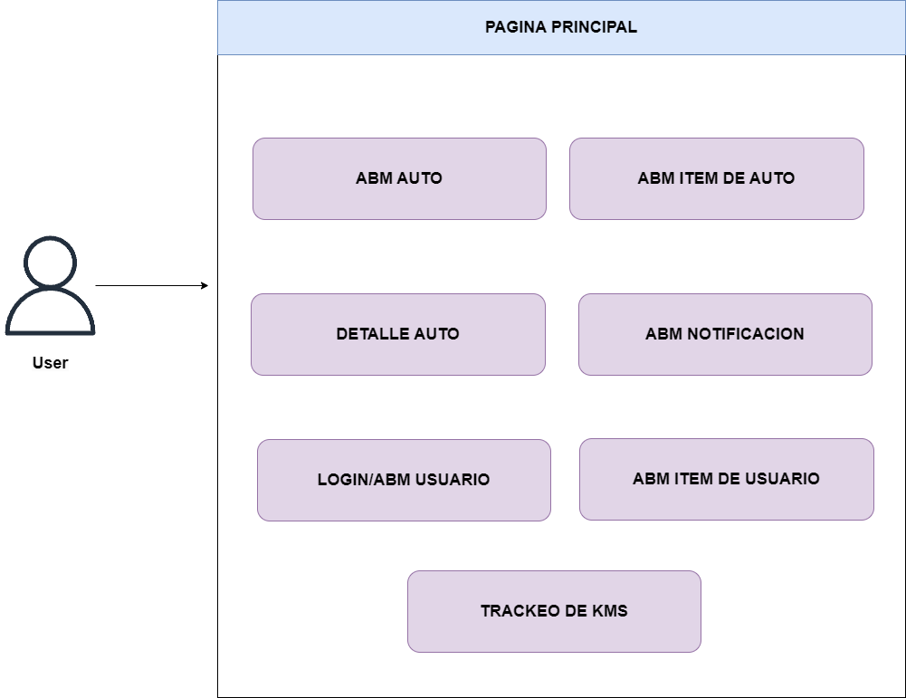

# Kuruma-Docs

**Descripción:**
Kuruma es un proyecto que tiene como objetivo convertirse en una web-app para centralizar la administración de un vehículo. Este proyecto se encuentra actualmente en una etapa de concepto (PoC).

**Presentación:**
Puedes encontrar una presentación detallada del proyecto en este [enlace](https://docs.google.com/presentation/d/1PSSQ1QTzhdLFFvP2EvH3GRkeTXDN7T419HXD_mnkW1M/edit?usp=sharing).

## Acerca de Kuruma
Kuruma busca simplificar la gestión y seguimiento de tu vehículo, proporcionando una plataforma web fácil de usar y centralizada para administrar la información relacionada con tu vehículo.

## Características Principales
- **Gestión de Datos**: Registra y administra información sobre tu vehículo, como mantenimientos, reparaciones, etc.
- **Notificaciones**: Recibe recordatorios y alertas relacionadas con el mantenimiento y los plazos importantes de tu vehículo.

# Arquitectura:
<b>Usuario consultando el detalle de su auto</b>

# UML

 

# Use cases

<b> POC: </b> 

 

<b> Car Detail </b>
 
The user can check the car's details, information about the car, and the last maintenance. Also recommendations and advices
 
<b> Car List </b>
 
The user explore the list of cars and select any of them
 

